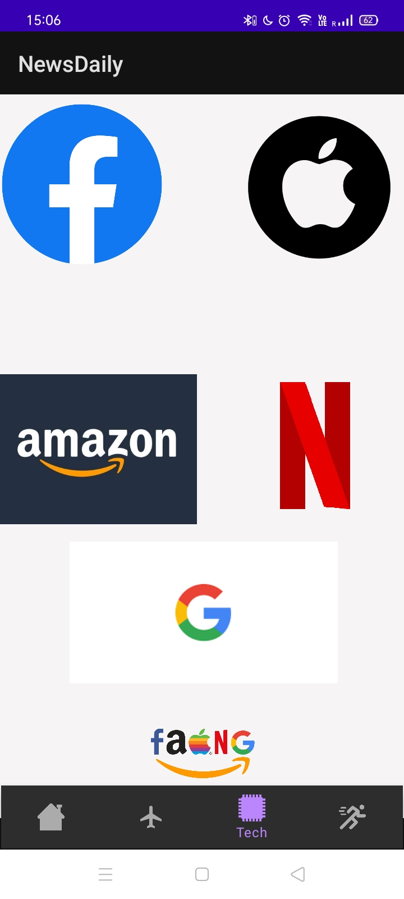

# NewsDaily
NewsDaily is a news showing app ,  bringing you latest headlines from across various genres , it is built purely using Kotlin.

Here are the technologies used to make it work:-

## UI/UX

1.Each news item is a CardView , consisting of an image and two text views one showing the headline another the 
abbreviated details.

2.Moving across various genres is made possible by the BottomNavigationView , enabling user to view any genre he/she wants.

3.The various CardViews are shown in a RecylerView , for best performence and smoothness.

## Backend

1.News is fetched from an [API](https://newsapi.org/) using the Retrofit Library .

2.Images from the API is parsed into an imageView using [Glide Library](https://github.com/bumptech/glide)

## Results  , Screenshots of the App

**Home**

**International Headlines**

**Tech News Across Companies**

** Sample Search For Apple **

**Sports News**

